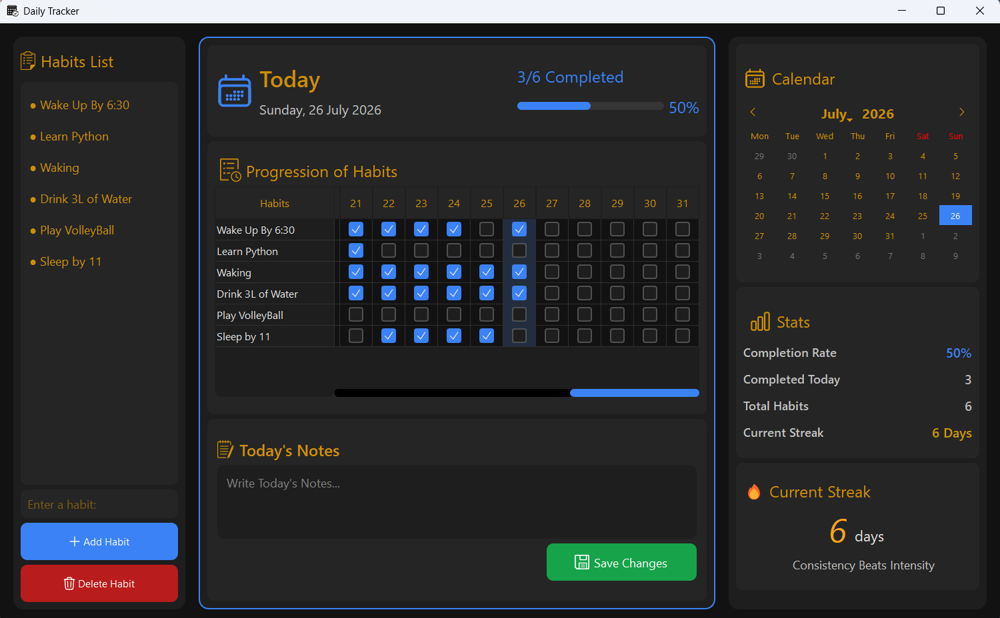

# 📖 Daily Tracker

**Author:** S R Nigil Vignesh

Daily Tracker is a modern desktop habit-tracking application built with **Python**, **PyQt5**, and **MySQL**. It helps users build consistent routines by allowing them to create habits, track daily progress, maintain streaks, and write daily notes—all within a clean, responsive, and intuitive desktop interface.

The application stores all data locally in a MySQL database and performs database operations using background threads, ensuring a smooth, non-blocking user experience.

---

# ✨ Features

## 📝 Habit Management

- Add and delete habits with ease.
- Prevents duplicate habit entries.
- Input validation for cleaner and more reliable data.
- Instant UI updates after habit changes.

---

## ✅ Daily Habit Tracking

- Mark habits as completed for each day.
- Completion status is stored permanently in the database.
- Only the current day's habits are editable.
- View previous months' completion history.

---

## 📊 Progress Dashboard

- Live completion percentage.
- Progress bar with visual feedback.
- Completed habits versus total habits.
- Real-time statistics update automatically.

---

## 🔥 Streak Tracking

- Automatically calculates your current streak.
- Correctly restores streak after restarting the application.
- Encourages consistency through small daily progress.

> **Consistency Beats Intensity.**

---

## 📅 Interactive Calendar

- Navigate between months effortlessly.
- Habit table automatically synchronizes with the selected month.
- Correctly handles months with **28, 29, 30, and 31 days**.
- Easily review previous months' progress.

---

## 📒 Daily Notes

- Write daily notes or journal entries.
- Notes are automatically saved.
- Previously saved notes load when the application starts.

---

## 💾 MySQL Database

- Stores habits, daily logs, and notes.
- Uses relational database design with foreign key constraints.
- Secure configuration using environment variables (`.env`).
- Clean separation between the user interface and database layer.

---

## ⚡ Responsive User Experience

- Database operations run in the background using **QThread**.
- Non-blocking interface while loading or saving data.
- Real-time updates using Qt's signal-slot mechanism.
- Smooth and responsive desktop experience.

---

## 🎨 Modern Desktop Interface

- Clean dark-themed design.
- Custom SVG icons.
- Interactive calendar.
- Progress dashboard.
- Responsive tables with synchronized scrolling.
- Highlighted current day for improved usability.

---

# 🛠️ Tech Stack

- Python
- PyQt5
- MySQL
- mysql-connector-python
- Qt Signals & Slots
- QThread

---

# 🚀 Installation

## 1. Clone the repository

```bash
git clone https://github.com/Nigil-Vignesh-S-R/daily-tracker.git

cd daily-tracker
```

## 2. Install dependencies

```bash
pip install -r requirements.txt
```

## 3. Start the application

```bash
python main.py
```

---

# 📷 Screenshots

> *

- Dashboard
- Calendar Navigation
- Daily Notes
- Statistics Panel

---

# 📈 Current Features

- ✅ Habit Management
- ✅ Daily Habit Tracking
- ✅ Calendar Navigation
- ✅ Current Streak
- ✅ Progress Dashboard
- ✅ Daily Notes
- ✅ Responsive UI (QThread)
- ✅ MySQL Backend
- ✅ Dark Theme

---

# 🚀 Roadmap

### Completed

- [x] Habit Management
- [x] Daily Tracking
- [x] Calendar Navigation
- [x] Current Streak
- [x] Daily Notes
- [x] Progress Dashboard
- [x] Responsive Database Operations

### Planned

- [ ] Monthly Analytics
- [ ] Completion Graphs (Matplotlib)
- [ ] Longest Streak Statistics
- [ ] Habit-wise Analytics
- [ ] CSV Export
- [ ] Settings Page

---

# 📌 Version

**Current Version:** `v1.0.1`

### Recent Improvements

- Fixed startup streak calculation.
- Fixed calendar and habit table synchronization.
- Fixed incorrect month lengths for February and 30-day months.
- Improved streak visualization.
- Enhanced calendar navigation.
- Multiple UI and UX improvements.

---

# 🎯 Purpose

Daily Tracker was created as a desktop application to practice modern software development concepts including GUI development with **PyQt5**, multithreading using **QThread**, relational database design with **MySQL**, and responsive application architecture.

The goal is to provide a distraction-free habit tracker while continuously improving the project through new features, better user experience, and cleaner software design.

---

## ⭐ If you like this project, consider giving it a star!
